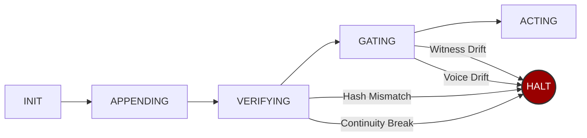

# sovereign-seal


`sovereign-seal` provides a local hash-chain ledger, witness-tip comparison and caller-supplied output checks. A caller that invokes the gate receives an exception when one of those checks fails. The package does not intercept arbitrary agent actions or prove that a statement, external effect or delivery is correct.

Hash continuity checks retained bytes. Witness agreement checks supplied tip files. Neither establishes an independently authenticated history if a principal can rewrite all copies. See [Security](SECURITY.md) for the trusted boundary.

```python
from sovereign_seal import SovereignSeal

seal = SovereignSeal("./ledger")
seal.append(action="deployed model v2", metadata={"model": "gpt-4o"})
seal.verify()  # replays full chain — passes or raises
seal.halt_or_proceed(witnesses=["./replica1", "./replica2"])
```

**Zero dependencies. Standard library only. Python 3.8+.**

> **Note:** Ledgers are **single-writer**. If multiple agents run concurrently, give each agent its own ledger directory.

---

## Install

```bash
pip install sovereign-seal
```

Or from source:

```bash
git clone https://github.com/prohormonePro/sovereign-seal.git
cd sovereign-seal
pip install -e .
```

---

## 5-Minute Demo

```bash
python examples/live_halt_demo.py
```

<!-- TODO: Record with asciinema rec demo.cast && agg demo.cast demo.gif -->
<!-- Then embed:  -->

```
--- Scenario 1: Clean output ---
[PASS] Agent may proceed. Output sealed.

--- Scenario 2: Hype with no evidence ---
[HALT] Voice drift: no_unverified_claims
       The agent was stopped. The output was not sent.

--- Scenario 3: PII exposure attempt ---
[HALT] Voice drift: no_pii_exposure
       The agent was stopped. PII was not exposed.

--- Scenario 4: Witness drift ---
[HALT] Witness drift detected: replica
       Even with clean output, stale witnesses = halt.
       The system chose silence over proceeding unverified.
```

**3 halts, 1 pass. The system refused 3 times. That's the feature.**

---

## The Three Configured Checks

- **Chain integrity** — Every action is SHA-256 hashed into an append-only ledger. Each entry chains to the previous. Changing an entry without coherently recomputing the chain is detected by verification. An authorized filesystem writer can rewrite a whole chain; separate trusted evidence is needed to detect that case.

- **Witness consensus** — Before acting, the system checks that all replica nodes agree on the current tip. A mismatching or missing supplied tip raises an error. This is not a distributed consensus protocol or a proof that all failures are caught before damage.

- **Voice governance** — Output passes through your rules before release. Caller-supplied functions can reject selected patterns. A passing vocabulary check does not establish privacy or supporting evidence.

---

## Architecture


<details>
<summary>Mermaid source (renders on GitHub)</summary>



</details>

---

## Drop-In Wrapper

A single-writer syntactic demonstration. The checks below do not validate citations, detect all personal information, or establish factual accuracy. `prepare_response` records preparation only; it never sends a response. A real connector must separately reconcile its provider outcome before recording delivery.

```python
from sovereign_seal import SovereignSeal, SealError

seal = SovereignSeal("./ledger")
replica = "./replica"
# Fresh demonstration directories only. Do not overwrite real witness evidence.
seal.export_tip(replica)

def no_ssn_marker(text):
    return "ssn:" not in text.lower()

def has_evidence_word(text):
    return any(w in text.lower() for w in ["study", "data", "tested", "verified"])

def prepare_response(agent_output: str) -> str:
    """Returns text after these configured checks; no delivery occurs here."""
    seal.halt_or_proceed(
        witnesses=[replica],
        voice_checks=[no_ssn_marker, has_evidence_word],
        voice_input=agent_output,
    )
    seal.append(action="response prepared", metadata={"len": len(agent_output)})
    seal.export_tip(replica)
    return agent_output

# Usage:
try:
    safe = prepare_response(my_agent.run(query))
    send_to_user(safe)
except SealError as e:
    log_halt(e)  # agent was stopped
```

The usage block contains application placeholders. An exception or timeout from `send_to_user` can leave delivery unknown; do not retry a conflicting send merely because this local ledger has no acceptance record.

---

## Integration

The following sketches are not tested framework integrations. Variables, connectors and application checks must be supplied by the caller. A gate after a mutating tool call cannot prevent an effect that already happened. None of these snippets establishes remote delivery, idempotency or rollback.

### With LangChain

```python
from sovereign_seal import SovereignSeal

seal = SovereignSeal("./agent_ledger")

# Before any chain.invoke():
seal.halt_or_proceed(witnesses=["./replica"])

# After execution:
seal.append(action="chain.invoke completed", metadata={"input": query})
seal.export_tip("./replica")
```

### With an application response

```python
seal = SovereignSeal("./assistant_ledger")

# Before sending response to user:
seal.halt_or_proceed(
    voice_checks=application_checks,  # Must be implemented for the actual application
    voice_input=assistant_response,
)
seal.append(action="response prepared", metadata={"thread": thread_id})
```

### With CrewAI / AutoGen / Any Multi-Agent Framework

```python
seal = SovereignSeal("./multi_agent_ledger")

def governed_step(agent, task):
    seal.halt_or_proceed(witnesses=["./witness1", "./witness2"])
    result = agent.execute(task)
    seal.append(action=f"{agent.name}: {task}", metadata={"result": result})
    seal.export_tip("./witness1")
    seal.export_tip("./witness2")
    return result
```

---

## Scope of comparison

This package demonstrates local ledger checks. It has not been benchmarked against workflow engines or safety frameworks, and it does not establish that they lack equivalent safeguards. Choose controls from the actual authority, storage and target-effect contract.

## Threat Model

| Attack | Detection | Response |
|--------|-----------|----------|
| Corrupt a ledger entry | `HashMismatch` at the exact line | **Halt** |
| Break prev_hash chain | `ContinuityBreak` at the break point | **Halt** |
| Stale witness pointer | `WitnessDrift` listing disagreeing witnesses | **Halt** |
| Missing witness | `WitnessDrift` with tip=`MISSING` | **Halt** |
| Banned output content | `VoiceDrift` naming the failed check | **Halt** |
| Missing evidence markers | `VoiceDrift` naming the failed check | **Halt** |

The listed checks raise exceptions. Application code must handle those exceptions and must separately account for external effects. Unlisted failure modes are not covered by this table.

---

## API

### `SovereignSeal(ledger_dir)`

Initialize a governance layer. Creates an append-only NDJSON ledger.

### `seal.append(action, metadata=None, kind="SEAL_EVENT") → SealEntry`

Append an entry to the chain. Returns a `SealEntry` with the computed hash.

### `seal.verify() → VerifyResult`

Re-verify the entire chain from genesis. Rebuilds every preimage, recomputes every hash.

**Raises:** `ContinuityBreak`, `HashMismatch`

### `seal.halt_or_proceed(witnesses, voice_checks, voice_input) → WitnessReport`

The governance gate. Three checks. Any failure = halt.

**Raises:** `ContinuityBreak`, `HashMismatch`, `WitnessDrift`, `VoiceDrift`

### `seal.export_tip(target_dir) → str`

Replicate the current tip hash to a witness node directory.

---

## Test Suite

```bash
python -m unittest tests.test_adversarial -v
```

**15 tests. 5 attack categories. All deterministic. No flaky tests.**

1. **Corrupt entry** → `HashMismatch` at exact line
2. **Break chain** → `ContinuityBreak` at exact line
3. **Witness drift** → `WitnessDrift` naming drifted witnesses
4. **Voice drift** → `VoiceDrift` naming failed check
5. **Full replay (100 entries)** → Tamper at line 50, caught at line 50

---

## Formal Specification

### Invariants

- **Hash continuity**: `E[i].prev_hash == E[i-1].entry_hash` for all `i > 0`
- **Preimage binding**: `E[i].entry_hash == SHA256(preimage(E[i]))` where preimage is canonical JSON excluding `entry_hash`
- **Witness agreement**: `W[j].tip == local.tip` for all witnesses at gate time
- **Voice compliance**: `C[k](output) == True` for all registered checks

### Halt Conditions

The system raises (does not proceed) when any invariant is violated. There is no "warn and continue" mode.

### Failure Recovery

| Mode | Cause | Recovery |
|------|-------|----------|
| Corrupted entry | Bit flip, disk error, malicious edit | Restore only from an independently trusted full backup; exported tip alone is not a backup |
| Chain break | Reordered/deleted entry | Restore only from an independently trusted full backup; exported tip alone is not a backup |
| Witness drift | Network partition, stale pointer | Reconcile the disagreement before selecting an authoritative tip; do not overwrite contrary evidence |
| Voice drift | Agent hallucination, policy violation | Regenerate output, re-gate |

---

## Origin

Extracted from a production governance pipeline running 225+ sealed stages across three AI providers (Anthropic, Google, OpenAI) with cryptographic verification on every output.

Built by [Travis Dillard](https://github.com/prohormonePro) at ProHP LLC.

The core insight: alignment isn't about making models smarter. It's about making systems willing to stop.

---

## License

MIT. Use it. Fork it. Ship it.
