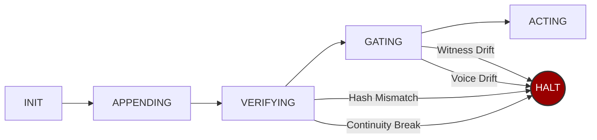

# sovereign-seal


**AI agents drift. Logs don't stop them.**

`sovereign-seal` is a deterministic governance layer that **halts** an agent unless it can prove:
1. its history is intact,
2. its witnesses agree, and
3. its output passes your rules.

Most agent frameworks focus on *coordination*: prompting, retrying, and hoping the LLM behaves. `sovereign-seal` shifts the paradigm to *specification*. It moves the invariant from a prompt to a cryptographic invariant.

```python
from sovereign_seal import SovereignSeal

seal = SovereignSeal("./ledger")
seal.append(action="deployed model v2", metadata={"model": "gpt-4o"})
seal.verify()  # replays full chain — passes or raises
seal.halt_or_proceed(witnesses=["./replica1", "./replica2"])
```

**Zero dependencies. Standard library only. Python 3.8+.**

> **Note:** Ledgers are **single-writer**. If multiple agents run concurrently, give each agent its own ledger directory.

---

## Install

```bash
pip install sovereign-seal
```

Or from source:

```bash
git clone https://github.com/prohormonePro/sovereign-seal.git
cd sovereign-seal
pip install -e .
```

---

## 5-Minute Demo

```bash
python examples/live_halt_demo.py
```

<!-- TODO: Record with asciinema rec demo.cast && agg demo.cast demo.gif -->
<!-- Then embed:  -->

```
--- Scenario 1: Clean output ---
[PASS] Agent may proceed. Output sealed.

--- Scenario 2: Hype with no evidence ---
[HALT] Voice drift: no_unverified_claims
       The agent was stopped. The output was not sent.

--- Scenario 3: PII exposure attempt ---
[HALT] Voice drift: no_pii_exposure
       The agent was stopped. PII was not exposed.

--- Scenario 4: Witness drift ---
[HALT] Witness drift detected: replica
       Even with clean output, stale witnesses = halt.
       The system chose silence over proceeding unverified.
```

**3 halts, 1 pass. The system refused 3 times. That's the feature.**

---

## The Three Invariants

- **Chain integrity** — Every action is SHA-256 hashed into an append-only ledger. Each entry chains to the previous. Tamper with one line and every line after it breaks. Detected. Halted.

- **Witness consensus** — Before acting, the system checks that all replica nodes agree on the current tip. Stale pointers, network partitions, silent corruption — all caught before damage. Halted.

- **Voice governance** — Output passes through your rules before release. PII exposure, banned phrases, missing evidence — define checks as simple Python functions. Any failure = halted.

---

## Architecture



---

## Drop-In Wrapper

The fastest way to governance-wrap any agent:

```python
from sovereign_seal import SovereignSeal, SealError

seal = SovereignSeal("./ledger")
replica = "./replica"

def no_pii(text):
    return "ssn:" not in text.lower()

def must_cite(text):
    return any(w in text.lower() for w in ["study", "data", "tested", "verified"])

def governed_respond(agent_output: str) -> str:
    """Returns the output only if governance passes. Otherwise raises."""
    seal.halt_or_proceed(
        witnesses=[replica],
        voice_checks=[no_pii, must_cite],
        voice_input=agent_output,
    )
    seal.append(action="response emitted", metadata={"len": len(agent_output)})
    seal.export_tip(replica)
    return agent_output

# Usage:
try:
    safe = governed_respond(my_agent.run(query))
    send_to_user(safe)
except SealError as e:
    log_halt(e)  # agent was stopped
```

Copy, paste, run.

---

## Integration

### With LangChain

```python
from sovereign_seal import SovereignSeal

seal = SovereignSeal("./agent_ledger")

# Before any chain.invoke():
seal.halt_or_proceed(witnesses=["./replica"])

# After execution:
seal.append(action="chain.invoke completed", metadata={"input": query})
seal.export_tip("./replica")
```

### With OpenAI Assistants

```python
seal = SovereignSeal("./assistant_ledger")

# Before sending response to user:
seal.halt_or_proceed(
    voice_checks=[no_pii, no_hallucinations, must_cite_sources],
    voice_input=assistant_response,
)
seal.append(action="response sent", metadata={"thread": thread_id})
```

### With CrewAI / AutoGen / Any Multi-Agent Framework

```python
seal = SovereignSeal("./multi_agent_ledger")

def governed_step(agent, task):
    seal.halt_or_proceed(witnesses=["./witness1", "./witness2"])
    result = agent.execute(task)
    seal.append(action=f"{agent.name}: {task}", metadata={"result": result})
    seal.export_tip("./witness1")
    seal.export_tip("./witness2")
    return result
```

---

## Why Not X?

| Approach | What it does | What it doesn't do |
|----------|-------------|-------------------|
| **Prompt-based safety** | Asks the model to behave | Doesn't enforce. Model can ignore. |
| **Logging** | Records what happened | Doesn't prevent what happens next. |
| **Guardrails / NeMo** | Pattern-matches output | No chain integrity. No witness consensus. No cryptographic proof. |
| **sovereign-seal** | Halts unless proven safe | **That's the difference.** |

Logging tells you what went wrong *after*. `sovereign-seal` prevents it *before*.

---

## Threat Model

| Attack | Detection | Response |
|--------|-----------|----------|
| Corrupt a ledger entry | `HashMismatch` at the exact line | **Halt** |
| Break prev_hash chain | `ContinuityBreak` at the break point | **Halt** |
| Stale witness pointer | `WitnessDrift` listing disagreeing witnesses | **Halt** |
| Missing witness | `WitnessDrift` with tip=`MISSING` | **Halt** |
| Banned output content | `VoiceDrift` naming the failed check | **Halt** |
| Missing evidence markers | `VoiceDrift` naming the failed check | **Halt** |

Every failure mode is the same: **halt**. The system does not degrade gracefully. It stops and tells you why.

---

## API

### `SovereignSeal(ledger_dir)`

Initialize a governance layer. Creates an append-only NDJSON ledger.

### `seal.append(action, metadata=None, kind="SEAL_EVENT") → SealEntry`

Append an entry to the chain. Returns a `SealEntry` with the computed hash.

### `seal.verify() → VerifyResult`

Re-verify the entire chain from genesis. Rebuilds every preimage, recomputes every hash.

**Raises:** `ContinuityBreak`, `HashMismatch`

### `seal.halt_or_proceed(witnesses, voice_checks, voice_input) → WitnessReport`

The governance gate. Three checks. Any failure = halt.

**Raises:** `ContinuityBreak`, `HashMismatch`, `WitnessDrift`, `VoiceDrift`

### `seal.export_tip(target_dir) → str`

Replicate the current tip hash to a witness node directory.

---

## Test Suite

```bash
python -m unittest tests.test_adversarial -v
```

**15 tests. 5 attack categories. All deterministic. No flaky tests.**

1. **Corrupt entry** → `HashMismatch` at exact line
2. **Break chain** → `ContinuityBreak` at exact line
3. **Witness drift** → `WitnessDrift` naming drifted witnesses
4. **Voice drift** → `VoiceDrift` naming failed check
5. **Full replay (100 entries)** → Tamper at line 50, caught at line 50

---

## Formal Specification

### Invariants

- **Hash continuity**: `E[i].prev_hash == E[i-1].entry_hash` for all `i > 0`
- **Preimage binding**: `E[i].entry_hash == SHA256(preimage(E[i]))` where preimage is canonical JSON excluding `entry_hash`
- **Witness agreement**: `W[j].tip == local.tip` for all witnesses at gate time
- **Voice compliance**: `C[k](output) == True` for all registered checks

### Halt Conditions

The system raises (does not proceed) when any invariant is violated. There is no "warn and continue" mode.

### Failure Recovery

| Mode | Cause | Recovery |
|------|-------|----------|
| Corrupted entry | Bit flip, disk error, malicious edit | Restore from witness replica |
| Chain break | Reordered/deleted entry | Restore from witness replica |
| Witness drift | Network partition, stale pointer | Re-publish tip, re-verify |
| Voice drift | Agent hallucination, policy violation | Regenerate output, re-gate |

---

## Origin

Extracted from a production governance pipeline running 225+ sealed stages across three AI providers (Anthropic, Google, OpenAI) with cryptographic verification on every output.

Built by [Travis Dillard](https://github.com/prohormonePro) at ProHP LLC.

The core insight: alignment isn't about making models smarter. It's about making systems willing to stop.

---

## License

MIT. Use it. Fork it. Ship it.
